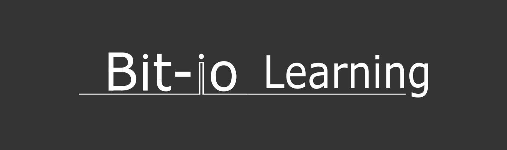

# Bienvenido al Bit-IO Learning.

Bit-IO learning es un espacio dedicado al aprendizaje de electrónica, programación y robótica desde cero. Creemos en el aprendizaje práctico y ofrecemos una variedad de recursos para ayudarte a empezar. 

En Bit-IO Learning, encontrarás una variedad de repositorios que te ayudarán a adquirir y mejorar tus habilidades en estos campos.

## Nuestros RepositoriEmpezar a aprender
### Electrónica desde cero

Este repositorio está diseñado para aquellos que están empezando en el mundo de la electrónica. Contiene tutoriales, ejemplos de proyectos y recursos útiles.

<a href="https://github.com/Bit-IO-learning/Aprende_electronica_desde_0" >Empezar a aprender</a>

### Programación desde cero

Si estás interesado en aprender a programar, este repositorio es para ti. Ofrecemos tutoriales en varios lenguajes de programación y te guiamos a través de proyectos prácticos.

<a href="https://github.com/Bit-IO-learning/Aprende_programacion_desde_0" >Empezar a aprender</a>

### Robótica desde cero

La robótica es un campo emocionante que combina la electrónica y la programación. En este repositorio, te enseñamos cómo construir tus propios robots desde cero.

<a href="https://github.com/Bit-IO-learning/Aprende_robotica_desde_0" >Empezar a aprender</a>

¡Esperamos que disfrutes y aprendas mucho en nuestro canal, Feliz aprendizaje!

## Contacto

Si tienes alguna pregunta o sugerencia, no dudes en contactarnos por medio de Instagram en <a href="https://www.instagram.com/electronica_bitio/" >@electronica_bitio</a>, o por el correo electronica.bitio@gmail.com.
